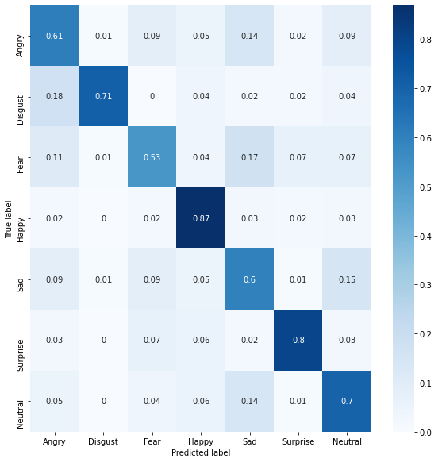

# Realtime Facial Expression Classification

This is a [Kaggle Challenge](https://www.kaggle.com/c/challenges-in-representation-learning-facial-expression-recognition-challenge). Personal Kaggle notebook for this challenge is [here](https://www.kaggle.com/kilean/transferlearning-oversampling-labelsmoothing-acc70)

The task is to categorize each face based on the emotion shown in the facial expression in to one of seven categories

<b style="word-space:2em">&nbsp;</b>  0=Angry, 1=Disgust, 2=Fear, 3=Happy, 4=Sad, 5=Surprise, 6=Neutral


# Performance
Good performance achieved: 70% accuracy over private test data (Kaggle provided). 

For comparison, the Kaggle [private leaderboard](https://www.kaggle.com/c/challenges-in-representation-learning-facial-expression-recognition-challenge/leaderboard) shows that 71% accuracy for the top rank and 69% accuracy fo the second rank.

# Strategy toward good performance
- Two stage transfer learning 
- Class balancing 
- Label smoothing
- Hyper-parameter adjusting ( dropout / learning rate )


### Transfer Learning
Used ResNet50 architecture of [keras-VGGFace](https://github.com/rcmalli/keras-vggface) for the pre-trained base. 
```python
from keras_vggface.vggface import VGGFace
vggface = VGGFace(model='resnet50', include_top=False, input_shape = (224,224,3))
vggface.trainable = False
```
In the first stage, the pretrained model is forzen.

Although the Kaggle [data](https://www.kaggle.com/c/challenges-in-representation-learning-facial-expression-recognition-challenge/data) consists of single channel 48x48 size images, the pretrained model input size 224x224 is kept as it is so that pretrained latent features do not change. 

The top layers are constructed in the following way:
```python
model = Sequential([vggface,
                    Flatten(),
                    Dropout(0.25),
                    Dense(2048, activation='relu'),
                    Dropout(0.25),
                    Dense(1024, activation='relu'),
                    Dense(7, activation='softmax', name = 'classifer')])
```
After training about 20 epochs (at which the loss curve tend to flat), the pre-trained model is unfrozen (except the batch normalization layers) for the 2nd stage fine tune.
```python
for layer in model.layers[0].layers:
    if 'bn' not in layer.name:
        layer.trainable = True
```


### Class balancing

Image data of each emotion is unbalanced
```python
import collections
print(collections.Counter(train_data.emotion))
```
<code>
<b style="word-space:2em">&nbsp;</b>  > Counter({0: 3995, 2: 4097, 4: 4830, 6: 4965, 3: 7215, 5: 3171, 1: 436})
</code>

note that number of samples for "Disgust" (represented by integer 1) is very few while "Happy" (represented by integer 3) is the most.


#####
Sampling more data from less represented classes helps balancing

```python
import imblearn
oversampler = imblearn.over_sampling.RandomOverSampler()
x_train, y_train = oversampler.fit_resample(train_data.pixels.values.reshape(-1,1),train_data.emotion.values)
print(collections.Counter(y_train))
```
<code>
<b style="word-space:2em">&nbsp;</b>  > Counter({0: 7215, 2: 7215, 4: 7215, 6: 7215, 3: 7215, 5: 7215, 1: 7215})
</code>

### Label smoothing
Data labels are not perfect. Label smoothing reduce prior belief from 100% sure to somewhere less than that. [Reference](https://www.robots.ox.ac.uk/~vgg/rg/papers/reinception.pdf)
```python
from copy import deepcopy as copy
def smooth_labels(y, smooth_factor):
    # Convert a matrix of one-hot row-vector labels into smoothed versions.
    y2 = copy(y)
    y2 *= 1 - smooth_factor
    y2 += smooth_factor / y.shape[1]
    return y2
```

# Results

#### Confusion matrix


Note that off diagonal parts of the confusion matrix is less than 20\%. Maybe *Class balancing* contributed well! (for comparision see [this](https://miro.medium.com/max/674/1*vq3P8waRENRLkEozhB4shQ.png) from [Reference](https://towardsdatascience.com/from-raw-images-to-real-time-predictions-with-deep-learning-ddbbda1be0e4))


#### Real time classification
Combined (frontal) face detection of OpenCV with the trained model for emotion classification. [Reference](https://towardsdatascience.com/from-raw-images-to-real-time-predictions-with-deep-learning-ddbbda1be0e4)

Follwoing is an example video of my kids and myself


The emotion of small kid seems not performing well. Maybe because the training data set are mostly adult faces? 
