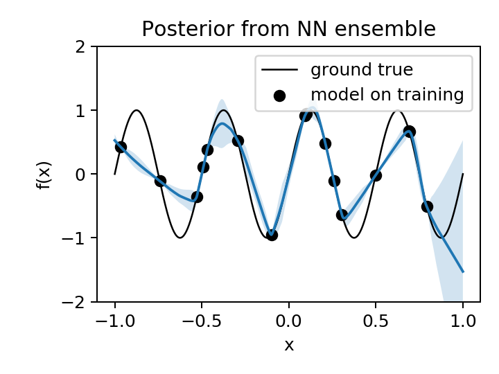

# Exploring Gaussian Process (GP) Regression for Bayesian Optimization

Here, we explore possible ways to improve probabilistic regression for surrogate model based optimization of a problem of high dimensional input space.

### Motivation
The [SLAC proposal](https://journals.aps.org/prab/abstract/10.1103/PhysRevAccelBeams.23.044601) of optimization strategy based on iterative neural network surrogate model + genetic algorithm  fascinated me. But I started to raise question about it's ability of reaching global minimum. For example, consider the following 1D potential that is an objective function:

  

Given the sparse training data (due to high evaluation cost) shown by the red stars, the surrogate model would not well represent the global optimum indicated by the green star. If a population based (global) optimization algorithm (like genetic algorithm) is applied on the surrogate model shown in the plot, the optimized population is likely avoid the global optimum. Even when any of random population land on near the global optimum, it would not be selected by optimizer due to high objective value from the surrogate model. This problem might be improved if the surrogate model can predict both mean and uncertainty of the objective like what GP does.

---
## 1. Gaussian Process (GP) Model VS. Neural Network (NN) Model 
The GP model is de facto standard surrogate model for Bayesian optimization possibly due to followings:

- GP is a Bayesian regression model: can incorporate prior belief
- GP can estimate uncertainty

However, NN can also be made to satisfy the above. Here, we explore which one to use for Bayesian optimization. Intuitively, we expect GP to outperform NN generally, as [infinitely wide NN is equivalent to GP](https://arxiv.org/abs/1711.00165). 

### Literature comparing NN and GP

A [literature](https://doi.org/10.1063/1.5003074) compares NN and GP on a regression problem (fitting potential energy surface). GP resulted better accuracy as stated in the folllowing abstract:

  <kbd>
    
  </kbd>

### Comparision with NN ensemble model on a 1D problem

Although, the NN ensemble model is not Bayesian, it can estimate uncertainty and can incorporate new data by training. A [test](./GPvsNN/GPvsNN.ipynn) on a 1D regression problem, GP outperformed NN ensemble. For a test, 16 identical MLPs (Multi-Layer Perceptron) are randomly initialized and trained to fit *f(x)=sin(4 &pi; x)* and compared to GPR (GP regression). The following comapres posterior estimate using GP (left) and NN ensemble (right):

   

---
## 2. Curse of dimensionality
