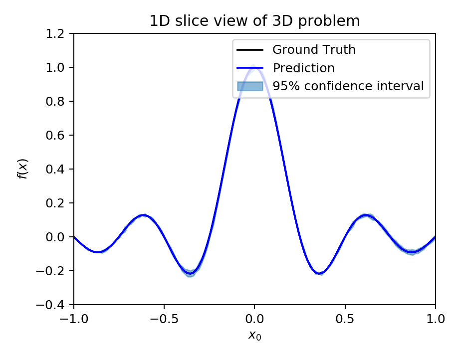

# Exploring Gaussian Process (GP) Regression for Bayesian Optimization

Here, we explore possible ways to improve probabilistic regression for surrogate model based optimization of a problem of high dimensional input space.

### Motivation

In a dynamic aperture optimization problem ([here](DAoptim_wSexts.pdf) for details), I have been following the [SLAC proposal](https://journals.aps.org/prab/abstract/10.1103/PhysRevAccelBeams.23.044601) of optimization strategy: iterative NN surrogate model + genetic algorithm. But I realized that it may not reach global minimum. For example, consider the following 1D potential that is an objective function:

  

Given the sparse training data (due to high evaluation cost) shown by the red stars, the surrogate model would not well represent the global optimum indicated by the green star. If a population-based (global) optimization algorithm (like the genetic algorithm) is applied to the surrogate model shown in the plot, the optimized population is likely to avoid the global optimum. Even when any random population land near the global optimum, it would not be selected by the optimizer due to the high objective value from the surrogate model. This problem might be improved if the surrogate model can predict both the mean and uncertainty of the objective like what GP does.

---
## 1. Gaussian Process (GP) Model VS. Neural Network (NN) Model 

[notebook](./GPvsNN/GPvsNN.ipynn)

The GP model is the de facto standard surrogate model for Bayesian optimization possibly due to the followings:

- GP is a Bayesian regression model: can incorporate prior belief
- GP can estimate uncertainty

On the other hand NN ensemble can also be made to satisfy the above. Here, we explore which one to use for Bayesian optimization.

For a test, 16 identical MLPs (Multi-Layer Perceptron) are randomly initialized and trained. The following compares the posterior estimate using GP (left) and NN ensemble (right) where the uncertainty is measured using prediction spread across the ensemble:

   

Further comparison between NN and GP on regression problem can be found in a [literature](https://doi.org/10.1063/1.5003074)

---
## 2. Curse of dimensionality

[notebook](./CurseOfDim/GP_CurseOfDim.ipynb)

Here, we explore how the dimensionality effect GP performance on a test example. The test problem is to fit the following (multi-dimensional) sinc function:

  

Note that the input dimension can be arbitrary. The following plot visualize *f(x)* with 2D input dimension and corresponding GP result (using 128 training data). 

  

We fix the number of training samples by 2048 and train GP for 3, 4, 6, and 12 input dimensions. The following plots show that the increase of dimensionality made the GP performance drastically decrease (compare 3D and 4D). Note also that for 6D and 12D, the GP did not learn much and stayed close to the prior (which was set to have zero mean). 

  

  

---
We are interested in an optimization problem with simulated data of large input dimensions (e.g. particle accelerator) and heavy cost for acquiring new data. We explored possible solutions to such problems: (1) construct prior from rough resolution simulation, (2) supervised dimensionality reduction.

The 2nd approach ([supervised dimensionality reduction](./DimReduction/DimReduction.md)) is still in progress. Here, we present the first one. 

## 3. Using Prior

[notebook](./wPrior/GP6D_wPrior.ipynb) for 6D problem
[notebook](./wPrior/GP12D_wPrior.ipynb) for 12D problem

In Bayesian models, the prior plays an important role especially when only a few training data is available. 

On the other hand, in a simulational study, it is often possible to speed up the simulation by sacrificing accuracy (e.g. decrease the number of particles for particle tracking simulation, decrease the number of mode or grid for field calculation, etc).

Assuming, we have roughly estimated prior, we try again the 6D problem (as in the previous section). The following plot visualize (slice view) the assumed prior where the difference of the prior from ground true is modeled by a collection of randomly initialized NNs.

  

Then, we train GP using 2048 (accurate) data sample (as was done in the previous section) on top of the assumed prior. The following plot shows posterior. 

  

Recall that in the previous section, when zero mean prior used, the GP could not learn much for the 6D problem. But note here that with assumed rough prior, the GP performs much better. 

Similarily, for the 12D problem 

  

*However*, the cost of obtaining enough data to reconstruct the prior can be still daunting when the input dimension is large.

### 3.2. Prior from assumed (roughly estimated) data

[notebook](./wPrior/approxPriorFromData/GP4D_wPrior.ipynb) for 4D problem

Here we try to reconstruct the prior using assumed data (100 times larger number of data: 204800) that represent reduced accuracy (low resolution) simulation. 
*Instead of mean square error loss, we increase the power to higher even number (Mean Power Error Loss: [MPELoss](./MPELoss/MPELoss.md)) in order to account for outliers.*

Following is example on 4D problem: 

     

