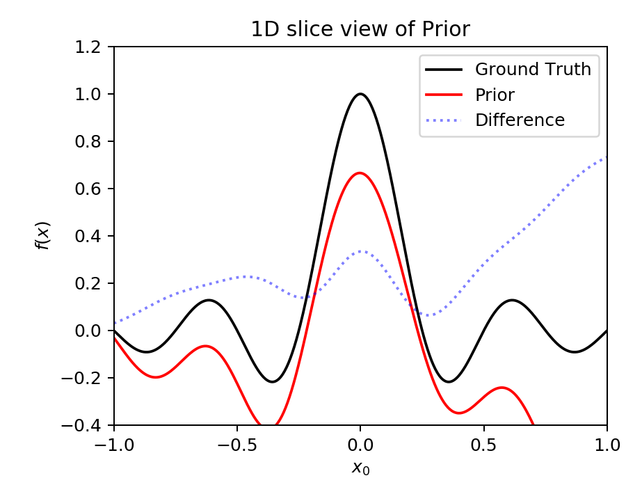

# Exploring Gaussian Process (GP) Regression for Bayesian Optimization

Here, we explore possible ways to improve probabilistic regression for surrogate model based optimization of a problem of high dimensional input space.

### Motivation
The [SLAC proposal](https://journals.aps.org/prab/abstract/10.1103/PhysRevAccelBeams.23.044601) of optimization strategy based on iterative neural network surrogate model + genetic algorithm  fascinated me. But I started to raise question about its ability o reach the global minimum. For example, consider the following 1D potential that is an objective function:

  

Given the sparse training data (due to high evaluation cost) shown by the red stars, the surrogate model would not well represent the global optimum indicated by the green star. If a population-based (global) optimization algorithm (like the genetic algorithm) is applied to the surrogate model shown in the plot, the optimized population is likely to avoid the global optimum. Even when any random population land near the global optimum, it would not be selected by the optimizer due to the high objective value from the surrogate model. This problem might be improved if the surrogate model can predict both the mean and uncertainty of the objective like what GP does.

---
## 1. Gaussian Process (GP) Model VS. Neural Network (NN) Model 
The GP model is the de facto standard surrogate model for Bayesian optimization possibly due to the followings:

- GP is a Bayesian regression model: can incorporate prior belief
- GP can estimate uncertainty

However, NN can also be made to satisfy the above. Here, we explore which one to use for Bayesian optimization. Intuitively, we expect GP to outperform NN generally, as [infinitely wide NN is equivalent to GP](https://arxiv.org/abs/1711.00165). 

### Literature comparing NN and GP

A [literature](https://doi.org/10.1063/1.5003074) compares NN and GP on a regression problem (fitting potential energy surface). GP resulted in better accuracy as stated in the following abstract:

  <kbd>
    
  </kbd>

### Comparison with NN ensemble model on a 1D problem

Although the NN ensemble model is not Bayesian, it can estimate uncertainty and can incorporate new data by training. In a [test](./GPvsNN/GPvsNN.ipynn) on a 1D regression problem, GP outperformed NN ensemble. For a test, 16 identical MLPs (Multi-Layer Perceptron) are randomly initialized and trained to fit *f(x)=sin(4 &pi; x)* and compared to GPR (GP regression). The following compares the posterior estimate using GP (left) and NN ensemble (right):

   

Note that GP outperformed NN ensemble in this test.

---
## 2. Curse of dimensionality

Here, we explore how the dimensionality effect GP performance on a test example. The test problem is to fit the following (multi-dimensional) sinc function:

  

Note that the input dimension can be arbitrary. The following plot visualize *f(x)* with 2D input dimension and corresponding GP result (using 128 training data). 

  

We fix the number of training samples by 2048 and train GP for 3, 4, 6, and 12 input dimensions. The following plots show that the increase of dimensionality made the GP performance drastically decrease (compare 3D and 4D). Note also that for 6D and 12D, the GP did not learn much and stayed close to the prior (which was set to have zero mean). 

  

  

---
# How to mitigate the curse of dimensionality?

We are interested in an optimization problem with simulated data of large input dimensions (e.g. particle accelerator) and heavy cost for acquiring new data. We explore possible solutions to such problems: (1) construct prior from rough resolution simulation, (2) supervised dimensionality reduction.

---
## 3. Using Prior

In Bayesian models, the prior plays an important role especially when only a few training data is available. 

On the other hand, in a simulational study, it is often possible to speed up the simulation by sacrificing accuracy (e.g. decrease the number of particles for particle tracking simulation, decrease the number of mode or grid for field calculation, etc). In this case, the optimization is often practiced to start from low accuracy (fast) simulation increase accuracy (decrease speed) as the optimization tend to converge.

The Bayesian framework enables us to naturally incorporate such low accuracy data in terms of prior: we can use either GP or NN to build a prior model from the low accuracy data.

### 3.1. Assumed (roughly estimated) prior

Assuming, we have roughly estimated prior, we try again the 6D problem (as in the previous section). (see details from [here](./CurseOfDim/GP6D_wPrior.ipynb)) The following plot visualize (slice view) the assumed prior where the difference of the prior from ground true is modeled by a collection of randomly initialized NNs.

  

Then, we train GP using 2048 (accurate) data sample (as was done in the previous section) on top of the assumed prior. The following plot shows posterior. 

  

Recall that in the previous section, when zero mean prior used, the GP could not learn much for the 6D problem. But note here that with assumed rough prior, the GP performs much better. 

Furthermore, we tried the 12D problem using a 2048 (accurate) data sample (as was done in the previous section) on top of an assumed prior. (see details from [here](./wPrior/GP12D_wPrior.ipynb))  The following plots show the result.

It is a drastic improvement recalling that the GP could not fit *f(x)* even for the 4D problem. 

  

*However*, the cost of obtaining enough data to reconstruct the prior can be still daunting when the input dimension is large.

### 3.2. Prior from assumed (roughly estimated) data

Here, we assume that we have 100 times larger number of data (i.e. 204800) from the reduced accuracy (low resolution) simulation. Before we go furthr let's consider the relationship beween loss function and outliers:

#### Mean Power Error Loss 

The following histogram shows randomly generated 204800 data of the 4D test problem (the sinc function) in log-scale

  

Note that there are only a few data for *f(x)>0.2*. This is because, as the input dimension become larger, the volume occupied by the peak of sinc function becomes relatively smaller. On the other hand, the mean square error (MSE) is the de-facto standard loss for regression. However, in the test problem, the sum of square error on these data (*f(x)>0.2*) can be only a small portion compared to other points. Often this behavior is desirable in ML as such points are often statistical outliers. However, simulation based optimization problem, we do not want to ignore such data (*f(x)>0.2* for our test problem). In order to penalize (very) few data points with large error, we can increase the power from square to larger even number: Mean Power Error Loss (MPELoss)

Caveat: MPELoss may suffer from deep local minima. ( Momentum driven optimization like Adam can escape local minima due to training momentum. However, when the loss potential have deep local minima the optimizers are more likely stuck. We use following techniques to solve this: multiple batch, re-training with re-initialization and change of learning rate during training )

#### Data driven prior

Back to our test problem, we reconstruct the assumed (i.e. low resolution, low accuracy simulation) prior using larger amount (204800) of data. 

## 4. Supervised dimension reduction

Popular dimension reduction techniques including PCA, kernelPCA, ICA, AutoEncoder etc are unsupervised learning. In optimization problem where input parameters are explored to find the optimal output, the unsupervised or semi-unsupervised dimension reduction techniques are not applicable generally. 

On the other hand, the supervised dimension reduction techniques (e.g. [Sliced Inverse Regression](https://doi.org/10.2307/2290563), [Kernel Dimension Reduction](https://dl.acm.org/doi/10.5555/1005332.1005335), [Covariance Operator Inverse Regression](https://ieeexplore.ieee.org/document/4587404)) are inverse transformation based and are reltively old and not well known compared to the unsupervised dimension reduction techniques. 

Here, we apply a relatively new but very simple technique: the [bottleneck NN](https://link.springer.com/chapter/10.1007/978-3-642-15381-5_5), for supervised dimension reduction. The (reduced dimension) latent variables are then used as input parameters for GP. 

- 
