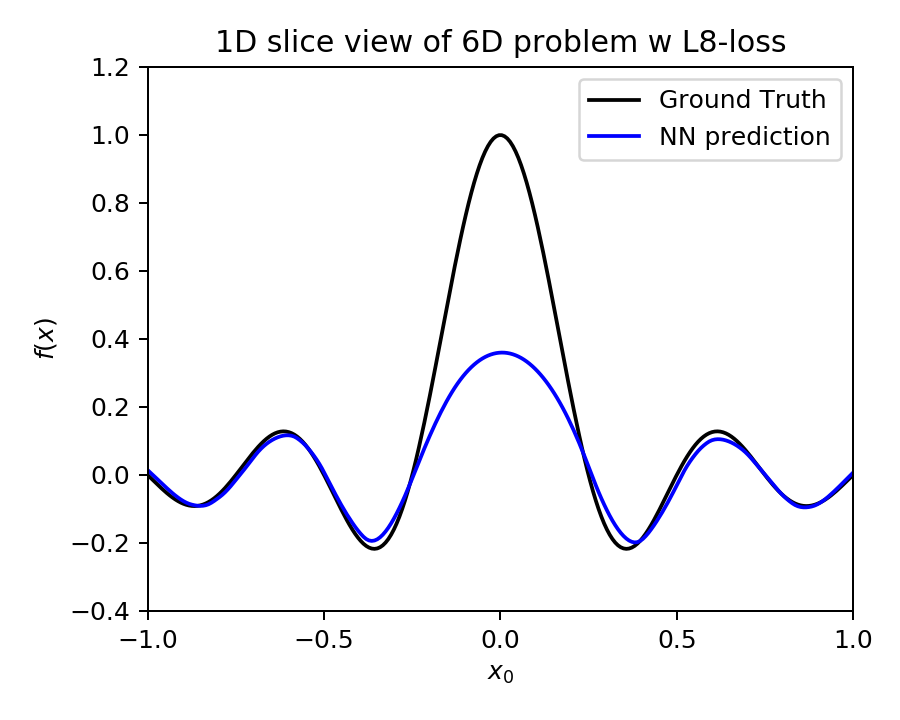
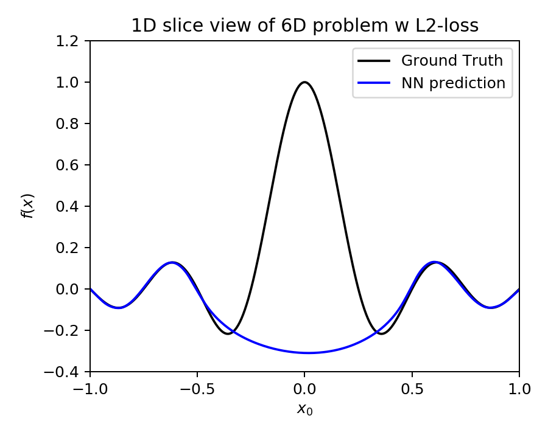

# Mean Power Error Loss 

In a regression using simulated data that is not corrupted by noise, every data points are important. However popular ML loss functions like Mean Squre Loss tend to ignore outliers. By increasing the power from squre to higher even number, the outliers can be accounted more seriously. 

For example, the following histogram shows randomly generated 204800 data of the 6D test problem (of the sinc function) in log-scale

  

Note that there are only a few data for *f(x)>0.15*. This is because, as the input dimension become larger, the volume occupied by the peak of sinc function becomes relatively smaller. The square error on these data (*f(x)>0.15*) can be only a small portion compared to other points. Often this behavior is desirable in ML as such points are often statistical outliers. However, simulation based optimization problem, we do not want to ignore such outliers. In order to penalize (very) few data points with large error, we can increase the power from square to larger even number: Mean Power Error Loss (MPELoss)

*Caveat.* MPELoss may suffer from the folowings:
- Deep local minima. 
  - Momentum driven optimization like Adam can escape local minima due to training momentum. However, when the loss potential have deep local minima the optimizers are more likely stuck. 
  - We use following techniques to solve this: multiple batch, re-training with re-initialization and change of learning rate during training.
- Loss can become NaN easily for large power
  - Can be alleviated by using small learning rate
  

Followings are example of NN model trained using p=8 (left) and p=2 (right) on 6D sinc function.

   

