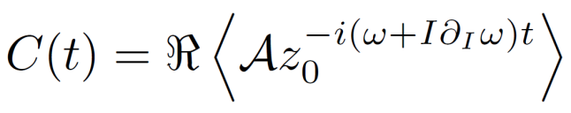
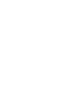
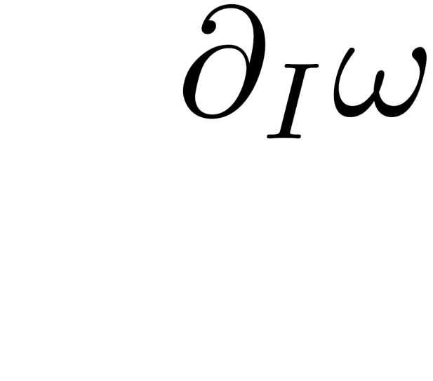
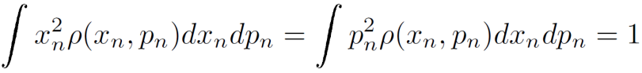
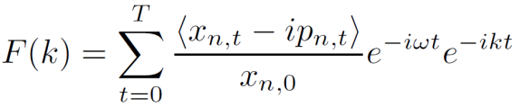
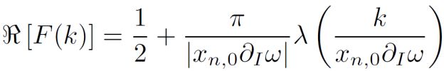

# Nonlinear decoherence of beam centroid.

Given an inital offset, the beam centroid evolution can be modeled by

  

where the bracket <> represent the ensemble average over particles, *zt = xt - ipt* is the complex canoncial variable at time *t*, *I=zz<super>\*</super>/2* is the action, and *A* is the transformation operator from physical coordinate to normal coordinate. 

<!--- The decoherence data is generated with 7 free parameters: initial offsets *x0, p0*, , initial emittance &epsilon;, optics parameters &alpha;, &beta;, bare frequency &omega;, and nonlinear detuning parameter &partial; . --->

# Limit of large initial offset

Consider normal coordinate normalized by emittance such that:

  

With an initial offset in normal coordinate *xn,0*, the frequency domain of the normalized centroid,

  

becomes

  

in the **limit of** *xn,0>>1* (i.e. **large initial offset compared to the initial emittance**).
