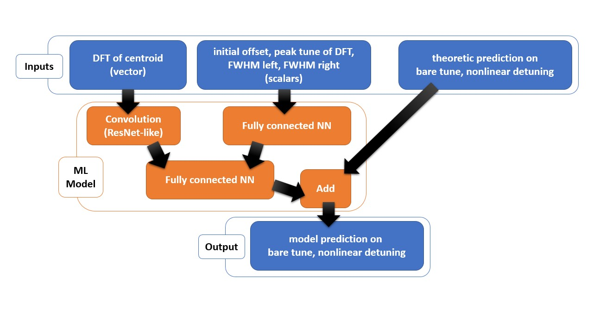
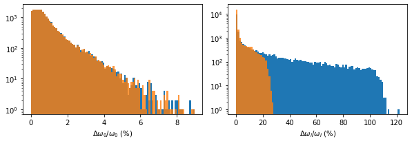
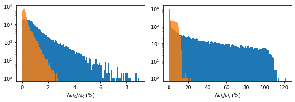

# Perturbative Correction Using ML 

this is part of the contents from a [slide](MLdecoherence1.pdf) which is presented in IOTA (Accelerator in Fermi Lab) collaboration meeting.

### Data Model and Goal

We assume the data to be time series of complex valued scalar. To be more specific, it is simulated measurement data of beam centroid from Beam Position Monitor (BPM). The details can be found from [here](Decoherence.md) or the [slide](MLdecoherence1.pdf). The data depends on the bare frequency *w0* and the frequency detuning parameter *w1* that we want to measure and other hidden parameters including initial offset, beam emittance, optics parameter, and etc that we assume that we are not interested in discovering. 

### Leading order theory

It can be shown that in the limit of large initial offset (compared to initial beam emittance), leading order term of centroid in frequency domain can be used to measure the  bare frequency *w0* and the frequency detuning parameter *w1*. 

### Correction to the leading order theory using NN model

However, the intial offset cannot be made arbitrarily large due to beam pipe and higher order nonlinearities. In addition, perturbative analytic calucation of the next leading order can be very complex. We model the perturbative correction using neural networks. 

### Strategies

##### 1. Input feature engineering: 1/x0
Since the leading order theory works in the limit of large offset, the next leading order would be smaller than the leading order term by factor of 1/x0. Therefore, additional input feature of 1/x0 may boost the model performance. Further input features based on terms appearing in the leading order theory or based on EDA (Explanatory Data Analysis) might be good to be added. (see more details on the [slide](MLdecoherence1.pdf))

##### 2. Convolution Layers for centroid data
Since the time series data is correlated between adjacent point in time ( or adjacent frequency in frequency domain), convolution layers may be more efficient than MLP. 

### Model
we use the following structure of NN model

  

### Result

  

  

  

