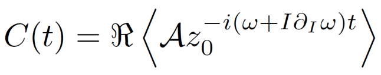
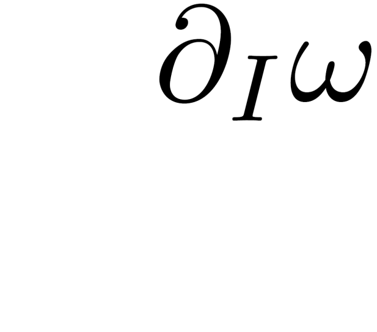

# Perturbative Correction Using ML ( applied on nonlinear decoherence data of beam centroid )
this is part of the contents in [Here](MLdecoherence1.pdf) which a slide presented in IOTA (Accelerator in Fermi Lab) collaboration meeting.

## Data Model 

Assume the following time series data model:

  

where the bracket <> represent the ensemble average over particles,  is the complex canoncial variable at time *t*,  is the action, and  is the transformation operator from physical coordinate to normal coordinate. The decoherence data is generated with 7 free parameters: initial offsets , , initial emittance , optics parameters , , bare frequency , and nonlinear detuning parameter .

## Leading order theory

Consider normal coordinate normalized by emittance such that:

  

With an initial offset in normal coordinate , the frequency domain of the normaized centroid,

  

becomes

  

in the **limit of**  (i.e. **large initial offset compared to the initial emittance**).

