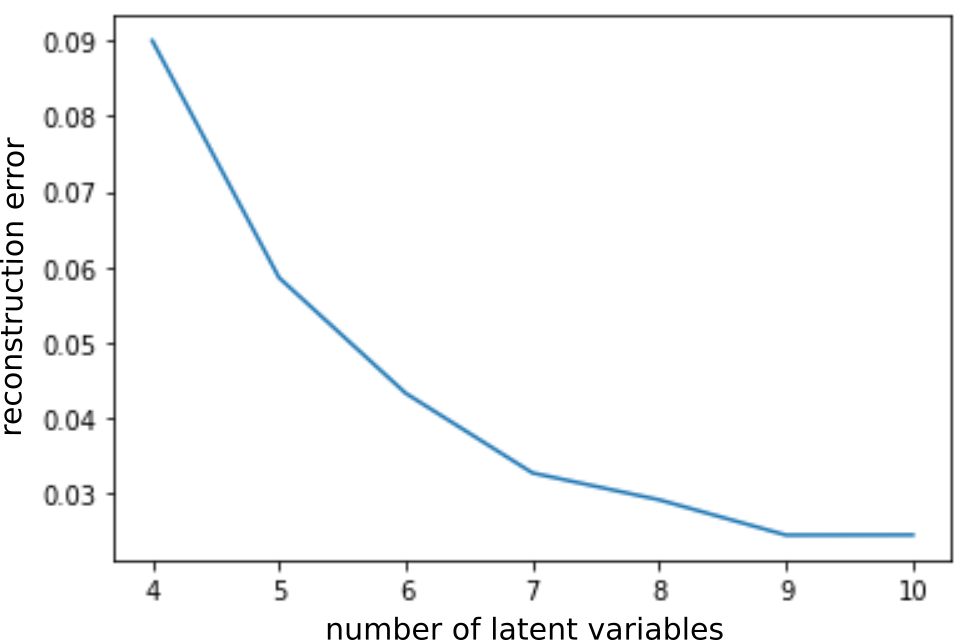
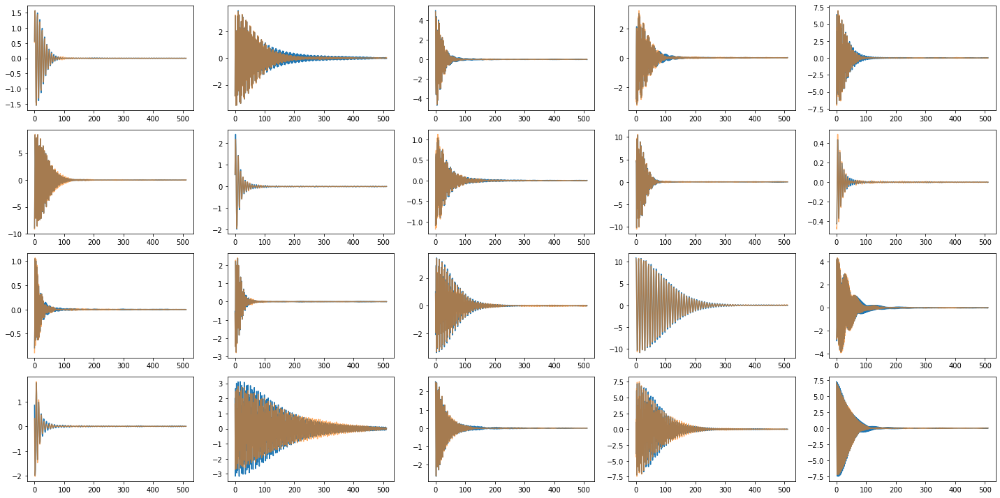
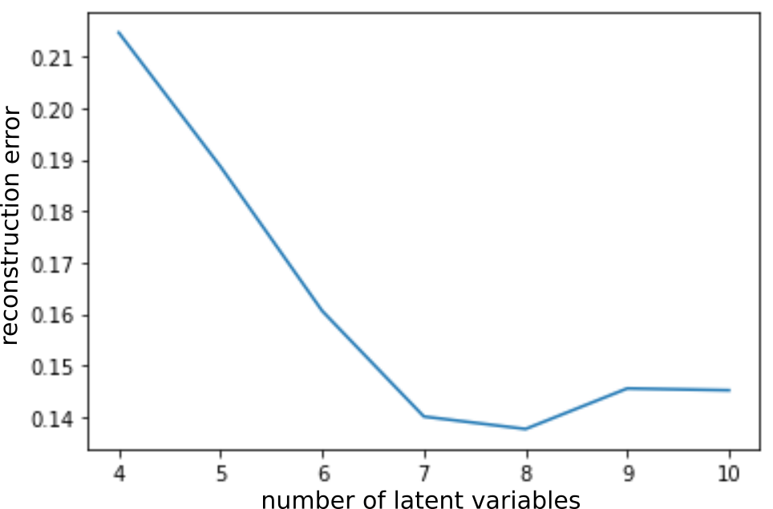
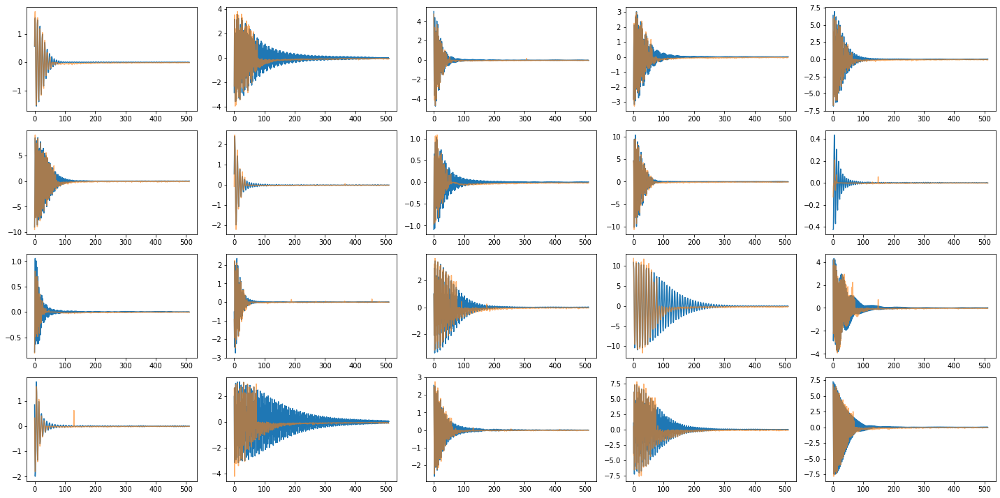

# How many inofrmations can be extracted from data?

this is part of the contents from a [slide](../PerturbativeCorrection/MLdecoherence1.pdf) which is presented in IOTA (Accelerator in Fermi Lab) collaboration meeting.

We apply [Variational AutoEncoder](../PaperReview/2014_VAE.ipynb) for nonlinear ICA ( Indepedent Component Analysis).

### Data Model

The data is simulated time-series signal from beam centroid from Beam Position Monitor (BPM). Further details can be found from [here](../PerturbativeCorrection/Decoherence.md) or the [slide](../PerturbativeCorrection/MLdecoherence1.pdf). **The data is generated using 7 free parameters**

-Following is the result using AutoEncoder. 
  - Left: number of latent variable vs Loss. Right: Samples of input data (blue) and reconstruction (orange) by model

  

Note that the loss tend to keep decreasing as the number of latent variable increases more than 7. 

-Following is the result using VAE. 
  - Left: number of latent variable vs Loss. Right: Samples of input data (blue) and reconstruction (orange) by model

  

Note that the reconsturction quality is worse than AutoEncoder, but the loss tend to saturate at 7 latent variables
